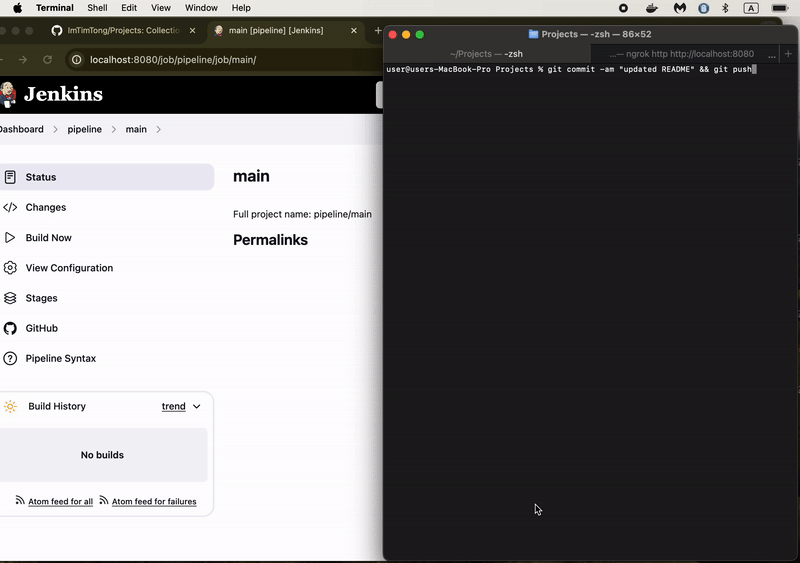

# Jenkins Pipeline

## [View Code](https://github.com/ImTimTong/Projects/tree/main/Jenkins-Pipeline)

## Overview
My "Projects" repo is configured to use webhooks with a public-facing URL for my local server generated by ngrok. Whenever a new commit is made to the repo, Github sends a push notification to the HTTP callback URL. ngrok then tunnels the POST request to my local Jenkins server running in a Docker container. This triggers the execution of the Jenkins pipeline defined in the Jenkinsfile. Effectively, this setup automates the CI/CD pipeline process.

## Features
- **Automated CI/CD Pipeline:** Automatically triggers build, test, and deploy stages on each commit.
- **Webhook Integration:** Uses GitHub webhooks to automate the process.
- **ngrok Tunneling:** Securely tunnels GitHub webhook requests to local Jenkins server.
- **Docker Integration:** Jenkins runs inside a Docker container for easy setup and isolation.
- **Modular Pipeline:** Uses Groovy scripts for modular and reusable pipeline steps.

## Jenkinsfile
The Jenkinsfile defines the stages of the CI/CD pipeline. It loads a Groovy script (`pipeline_steps.groovy`) which modularizes the steps for each stage.

## Groovy Script
The `pipeline_steps.groovy` script contains the actual shell commands and logic for each stage of the pipeline. It includes the following methods:

- **getUserConfirmation(message):** Prompts the user for confirmation with a custom message.
- **build():** Executes the build phase, listing the files in the current directory.
- **test():** Executes the test phase, temporarily changing to the parent directory, listing files, and returning to the original directory.
- **deploy():** Executes the deploy phase, showing the git status, environment variables, and system uptime.

## Demo

